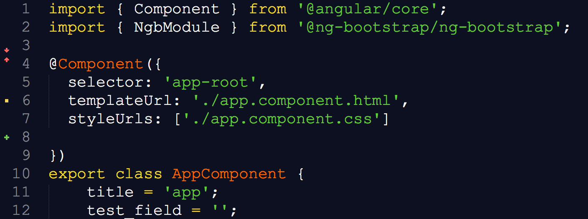

# Blackboard

## About

Blackboard is a simple theme and accompanying color scheme for Sublime Text 3/4. It is mostly derived from  [original Blackboard theme for Sublime Text 2](https://github.com/edwinlunando/sublime-settings/blob/master/Blackboard%20(SL).tmTheme).



## Main colors
- Background `#0C1021`
- Foreground white `#F8F8F8`
- Selection highligthed `#253B76`
- Blue `#8DA6CE`
- Yellow `#FBDE2D`
- Orange `#FF6400`
- Green `#61CE3C`
- Grey `#AEAEAE`

## Installation
Blackboard is a Sublime package. To install it:

1. [Download theme files](https://github.com/pierresh/Theme-Blackboard/archive/master.zip)
2. Unzip the files and copy the folder called "Theme - Blackboard" into your Sublime Text 3 Packages directory. You can find that directory by selecting "Preferences > Browse Packages ...".
3. Activate the theme by modifying your user preferences to include the following:

```javascript
{
  "color_scheme": "Packages/Theme - Blackboard/Blackboard.tmtheme"
}
```

If you need help locating your user preferences file, you can find it selecting "Preferences > Settings - User".
